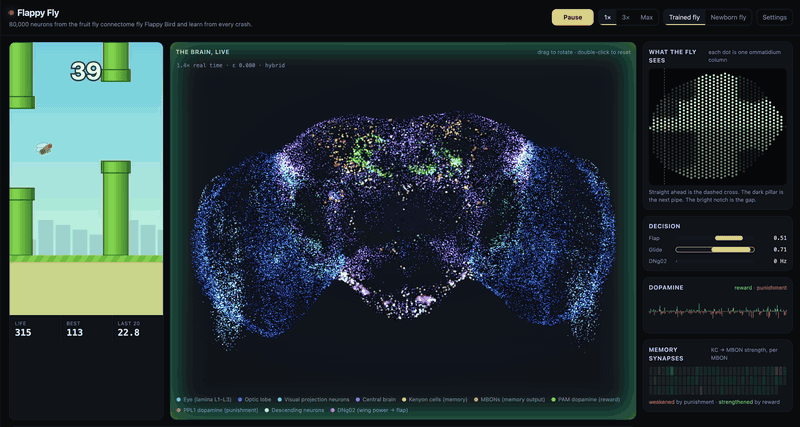
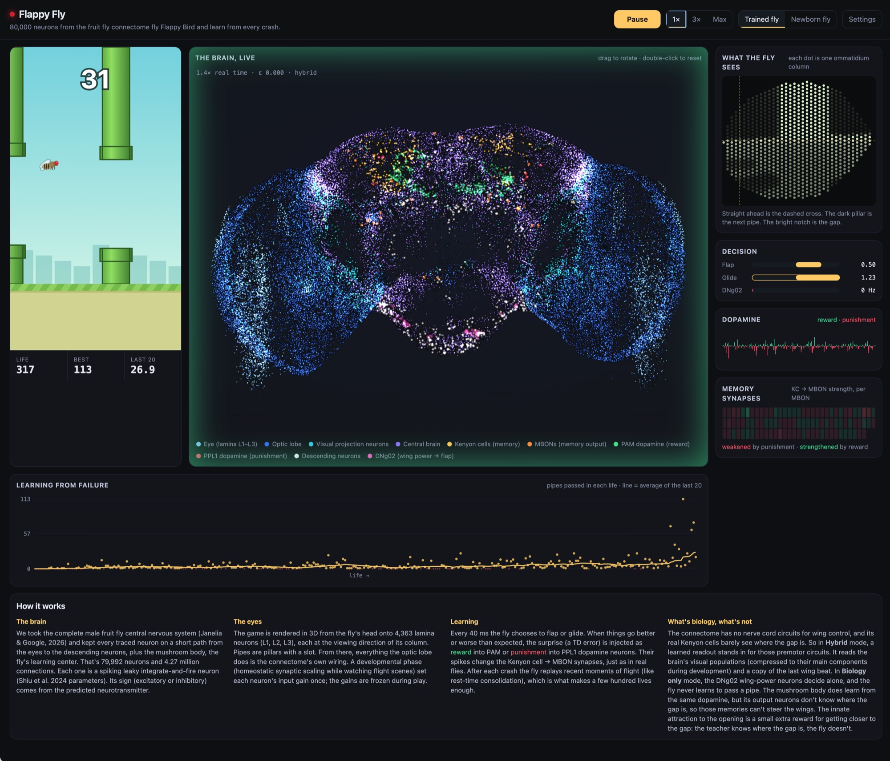

# Flappy Fly

**A real fruit fly brain, rebuilt neuron by neuron from its connectome, plays Flappy Bird and learns from every crash.**



▶︎ [Watch the full 1:44 recording](docs/media/flappyfly-demo.mp4)

Flappy Fly takes the wiring diagram of a male fruit fly's nervous system (the
[Janelia/Google male CNS connectome](https://research.google/blog/a-connectomics-milestone-mapping-the-complete-male-fruit-fly-brain/),
166,000 neurons and 125 million synapses) and turns it into a working brain that flies
through the pipes. The game is projected onto the fly's compound eye. The signal travels
through the fly's own optic lobe wiring, and each crash or passed pipe releases dopamine
that changes its synapses. A newborn fly crashes into almost every pipe. A few hundred
lives later it flies through dozens in a row.

Everything runs live in your browser: 80,000 spiking neurons simulated every millisecond,
with every spike drawn on screen.



## Try it

```bash
git clone https://github.com/baltap/FlappyFly.git
cd FlappyFly
npm run serve
```

Open http://localhost:8350. Node 18+ is all you need; there are no dependencies to install.

* **Trained fly**: a fly that has already learned from about 300 lives of crashing.
* **Newborn fly**: a blank fly. Watch the learning curve climb as it fails its way to skill.
* **1× / 3× / Max**: simulation speed. Max runs as fast as your machine allows.
* **Settings**: switch learning, exploration and the innate gap attraction on or off,
  let the flight neurons decide alone ("Biology only"), try the original game's tighter
  pipes, or tap for the fly with Space.

## What you're looking at

| Panel | What it shows |
|---|---|
| **The brain, live** | All 79,992 simulated neurons at their real positions, seen from the front. Each one flashes when it fires. Blue: eye and optic lobes. Violet: central brain. Amber and orange: the mushroom body, the fly's memory centre. Green and red: reward and punishment dopamine neurons. White and pink: the neurons that descend to the wings. Drag to rotate. |
| **What the fly sees** | The right eye, one dot per ommatidium column, at the direction that column looks. The dark pillar is the next pipe; the bright notch in it is the gap. |
| **Decision** | Every 40 ms the fly weighs flapping against gliding. |
| **Dopamine** | The fly's surprise. Green when things go better than expected (a pipe passed), red when worse (a crash coming). |
| **Memory synapses** | How dopamine has strengthened or weakened the Kenyon cell → MBON synapses of each memory output neuron. |
| **Learning from failure** | Pipes passed in each life, with the average of the last 20. |

## How it works

```
 game (3D) ──► compound eye ──► optic lobe ──► central brain ──► descending neurons ──► wings
               4,363 lamina      (connectome     mushroom body       DNg02 "wing power"
               columns            wiring)        KC → MBON memory
                                                      ▲
      crash / pipe passed ──► surprise (TD error) ──► dopamine: PAM (reward) / PPL1 (punishment)
```

1. **The brain.** From the full connectome we keep every neuron on a short path from the
   eyes to the neurons that descend to the wings, plus the whole mushroom body. That's
   79,992 neurons and 4.27 million connections. Each is a leaky integrate-and-fire neuron
   (Shiu et al. 2024 parameters). Whether a synapse excites or inhibits comes from the
   neurotransmitter predicted for that cell.
2. **The eyes.** Each lamina column in the connectome has a position in the eye's hex
   grid, which tells us where it looks. The game is ray-traced in 3D from the fly's head
   into every column. From there on, all visual processing is the fly's own wiring.
3. **Growing up.** Before it ever plays, the fly watches flight scenes while every neuron
   tunes its input strength toward a healthy firing rate (homeostatic synaptic scaling).
   Then those settings are frozen.
4. **Learning.** When the outcome is better or worse than expected, that surprise is
   injected into the brain's dopamine neurons: PAM for reward, PPL1 for punishment. Their
   spikes change the synapses between Kenyon cells and mushroom body output neurons, the
   same place real flies store memories. The same surprise trains the fly's decision.
   After each crash the fly replays recent moments of flight, like consolidation during
   rest.

## Results

| | Pipes per life |
|---|---|
| Newborn fly, first 50 lives | ~0.6 to 2 |
| After 200 to 300 lives of learning | ~4 to 7 |
| **Trained fly, learning switched off** (30 lives) | **36.6** on average, median 33, 6 lives flew the full 2 minutes |
| Same fly, pipe layouts it has never seen | 34.8 |
| Same fly with its eyes switched off | **0** in every life |
| "Biology only": the wing neurons decide alone | 0 |

In the recording above, the trained fly reached **113 pipes in a single life**.

The blind test is the key control: with the eye input cut, the same fly passes nothing,
so every successful flight comes from what the connectome's eye sees.

## What's biology and what isn't

This project tries to be honest about where the fly ends and the engineering begins.

* **Real:** which neurons exist and how they connect, whether each synapse excites or
  inhibits, where each eye column looks, the dopamine neurons, and which memory
  synapses they teach (all from the connectome).
* **Modelled:** neuron dynamics (a standard spiking model) and the developmental tuning
  of input strengths.
* **Not biology:** the connectome covers the brain but not the nerve cord circuits that
  actually drive the wings. Its deep neurons also know that a pipe is coming, but not
  where the gap is. That information lives in the eye and optic lobe. So in **Hybrid**
  mode, a learned readout stands in for the missing wing circuits. It reads the eye
  layer's activity and a copy of the fly's last wingbeat, and it is trained by the same
  dopamine signal. In **Biology only** mode the brain decides alone, and it never learns
  to pass a pipe.
* **A teacher's hint:** a small extra reward for moving toward the gap ("innate
  attraction to the opening"). The teacher knows where the gap is; the fly only sees.
* **Not yet:** the original game's 100 px gaps. The fly trains on 150 px gaps and
  fails the tighter ones.

The full reasoning, including everything that didn't work, is in
[docs/DESIGN.md](docs/DESIGN.md). All measurements are in [docs/RESULTS.md](docs/RESULTS.md).

## Project layout

```
pipeline/   Python: extract the brain from the connectome, developmental PCA, decoding diagnostics
web/        the app: engine.js (spiking network), eye.js, game.js, agent.js (learning),
            plasticity.js (dopamine), worker.js (simulation thread), brainview.js (WebGL)
web/data/   the extracted brain, developed gains, eye components and the trained fly
sim/        Node: development, recording, training, evaluation, static server
tests/      npm test
```

## Rebuild everything from the connectome

You need the male CNS feather files (`body-annotations`, `body-neurotransmitters`,
`connectome-weights`) from [male-cns.janelia.org](https://male-cns.janelia.org), plus
[uv](https://docs.astral.sh/uv/) for the Python steps.

```bash
uv run python pipeline/build_brain.py --data /path/to/male-cns   # brain.bin + brain.json
node sim/develop.mjs 40 0.25                                     # development, fast …
node sim/develop.mjs 150 0.08 warm                               # … then slow → gains.f32
node sim/record_neurons.mjs 300                                  # record the eye in flight
uv run python pipeline/develop_npca.py lam 128 L1,L2,L3          # eye components
node sim/train.mjs --mode hybrid --episodes 300 --pcaK 64 --seed 3 --out runs/fly.json
node sim/evaluate.mjs runs/fly.json --lives 30                   # add --blind for the ablation
cp runs/fly.json web/data/pretrained.json
npm test
```

## Credits

* Connectome: the male CNS project by HHMI Janelia, Google Research, the MRC Laboratory of
  Molecular Biology and collaborators (2026).
* Neuron model parameters: Shiu et al., *A Drosophila computational brain model reveals
  sensorimotor processing*, Nature 2024.
* DNg02 as wing stroke amplitude control: Namiki et al. 2022.
* Flappy Bird: Dong Nguyen, 2013. This is a fan-made homage for research and fun.
